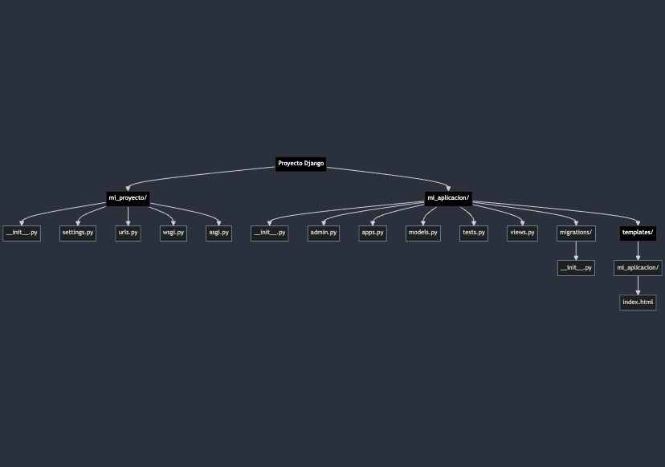

---
date:
  created: 2024-06-13
authors:
  - cesarlpb

categories:
  - Django
  
tags:
  - full-stack
  - intro

slug: intro-a-django
---

# Introducción a Django

Django es un framework web de alto nivel escrito en Python que permite un desarrollo rápido y un diseño limpio y pragmático. Fue diseñado para ayudarte a construir aplicaciones web de una manera más fácil y rápida.

<!-- more -->

## ¿Por qué usar Django?

<figure markdown="span">
  { width="700" }
  <figcaption>Estructura de archivos de Django</figcaption>
</figure>

Django proporciona una serie de características que lo hacen destacar entre otros frameworks web:

1. **Desarrollo Rápido**: Django te permite desarrollar aplicaciones web de manera rápida y eficiente. Con su arquitectura basada en el patrón Modelo-Vista-Plantilla (MVT), puedes construir y escalar proyectos web de manera organizada.
2. **Seguro por Defecto**: Django toma la seguridad en serio y ayuda a los desarrolladores a evitar errores comunes de seguridad, como la inyección SQL, los ataques de scripts entre sitios y la falsificación de solicitudes entre sitios.
3. **Escalable y Versátil**: Desde sitios personales hasta proyectos empresariales, Django puede manejar diferentes niveles de complejidad y tráfico.
4. **Comunidad Activa**: Con una comunidad grande y activa, siempre hay recursos disponibles, desde documentación hasta foros y grupos de usuarios.

## Componentes Principales de Django

<figure markdown="span">
  { width="700" }
  <figcaption>Diagrama de Django</figcaption>
</figure>

1. **Modelos**: Representan la estructura de los datos y permiten interactuar con la base de datos.
2. **Vistas**: Contienen la lógica de negocio y procesan las solicitudes del usuario.
3. **Plantillas**: Definen cómo se presentan los datos en el navegador.
4. **URLs**: Mapean las solicitudes a las vistas correspondientes.

## Primeros Pasos con Django

Para comenzar a trabajar con Django, sigue estos pasos básicos:

1. **Instalación**: Asegúrate de tener Python instalado. Luego, instala Django usando pip:
   ```bash
   pip install django
   ```

2. **Crear un Proyecto**: Crea un nuevo proyecto Django utilizando el comando:
   ```bash
   django-admin startproject mi_proyecto
   cd mi_proyecto
   ```

3. **Ejecutar el Servidor de Desarrollo**: Inicia el servidor de desarrollo para ver tu proyecto en acción:
   ```bash
   python manage.py runserver
   ```

4. **Crear una Aplicación**: Dentro de tu proyecto, crea una nueva aplicación:
   ```bash
   python manage.py startapp mi_aplicacion
   ```

## Conclusión

Django es una herramienta poderosa para desarrollar aplicaciones web con Python. Con su enfoque en la simplicidad y la reutilización de componentes, puedes construir y escalar tus proyectos web de manera eficiente. En próximos artículos, exploraremos más en detalle cada componente y funcionalidad de Django.
