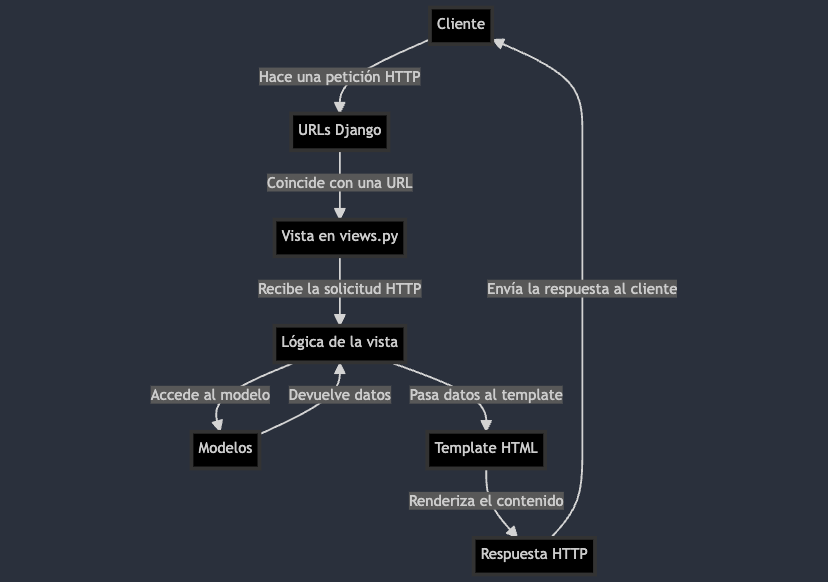

# Cómo Servir HTML con Django

Para completar este tutorial se debe tener un proyecto de Django creado, si aún no 
has creado un proyecto, puedes seguir [este tutorial](#) para crear un proyecto. 

Puedes incluir el template en el proyecto o en una app. Si necesitas crear una app
puedes seguir [este tutorial](#) sobre cómo crear una app en Django

- [Post](#) sobre las diferencias entre app y proyectos en Django. **¿Qué son y cuándo necesitas cada uno?**

---

Django se basa en el patrón *Model-View-Template (MVT)*. En este tutorial no incluiremos la parte del modelo pero puedes ver cómo funcionan estos componentes en el diagrama siguiente:

- **Model:** Representa la estructura de los datos y maneja la lógica de la base de datos. Los modelos se definen en el archivo models.py de una aplicación Django y suelen utilizarse para definir las tablas y campos de la base de datos.

---

Si ya tienes claro dónde colocar este HTML (template) que quieres servir con Django vamos a empezar con el tutorial.

<figure markdown="span">
  { width="300" }
  <figcaption>computer, science, ofc.</figcaption>
</figure>

